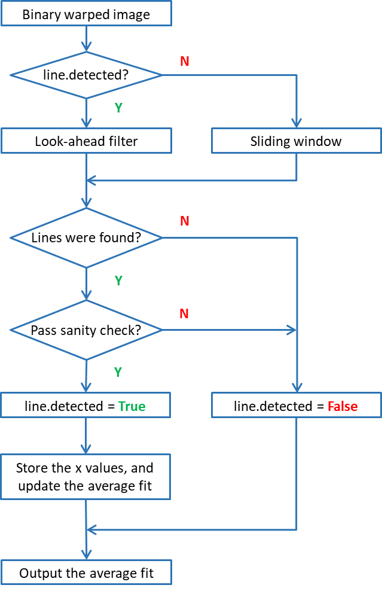
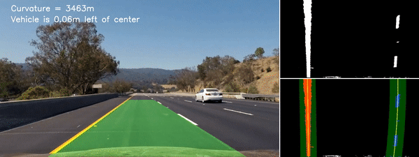
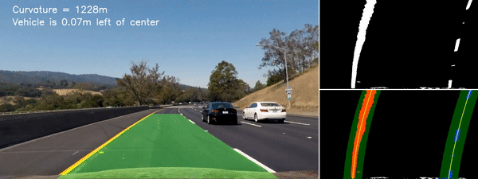

# Advanced Lane Finding Project
[](http://www.udacity.com/drive)

This repository presents an image processing pipeline for detecting lane lines in a variety of conditions, including changing road surfaces, curved roads, and variable lighting.


---

The goals / steps of this project are the following:

* Compute the camera calibration matrix and distortion coefficients given a set of chessboard images.
* Apply a distortion correction to raw images.
* Use color transforms, gradients, etc., to create a thresholded binary image.
* Apply a perspective transform to rectify binary image ("birds-eye view").
* Detect lane pixels and fit to find the lane boundary.
* Determine the curvature of the lane and vehicle position with respect to center.
* Warp the detected lane boundaries back onto the original image.
* Output visual display of the lane boundaries and numerical estimation of lane curvature and vehicle position.

Here I will consider the [rubric points](https://review.udacity.com/#!/rubrics/571/view) individually and describe how I addressed each point in my implementation. 

[//]: # (Image References)

[image1]: ./output_images/camera_cal.png "Camera Calibration"
[image2]: ./output_images/dist_corr.png "Distortion Correction"
[image3]: ./output_images/perspect_trans.png "Perspective Transform"
[image4]: ./output_images/col_thresh1.png "Color Thresholding 1"
[image5]: ./output_images/col_thresh2.png "Color Thresholding 2"
[image6]: ./output_images/grad_thresh1.png "Gradient Thresholding 1"
[image7]: ./output_images/grad_thresh2.png "Gradient Thresholding 2"
[image8]: ./output_images/com_thresh1.png "Color/Gradient Thresholding 1"
[image9]: ./output_images/com_thresh2.png "Color/Gradient Thresholding 2"
[image10]: ./output_images/search1.png "Color/Search 1"
[image11]: ./output_images/search2.png "Color/Search 2"
[image12]: ./output_images/screen1.png "Color/Screen 1"
[image13]: ./output_images/screen2.png "Color/Screen 2"
[image14]: ./output_images/find_line.png "Flowchart"

---

## Camera Calibration

The code for this step is in the notebook [`Camera Calibration.ipynb`](https://github.com/YuxingLiu/CarND-Advanced-Lane-Lines/blob/master/Camera%20Calibration.ipynb).  

A 9x6 chessboard is used for camera calibration. First, I prepared "object points" by assigning the (x, y, z) coordinates of the chessboard corners in the world, under the assumption that the chessboard is fixed on the (x, y) plane at z=0, and the object points are the same for each calibration image. Thus, `objp` is just a replicated array of coordinates, and `objpoints` will be appended with a copy of it every time all chessboard corners in a test image are successfully detected. `imgpoints` will be appended with the (x, y) pixel position of each of the corners in the image plane with each successful chessboard detection.  

Then, I used the `cv2.calibrateCamera()` function to compute the camera calibration and distortion coefficients. I applied this distortion correction to the chessboard image using the `cv2.undistort()` function and obtained this result: 

![alt text][image1]

## Pipeline (single image)

### Distortion Correction

The code for this step is contained in the code cells [3]-[4] of the notebook [`Test Video Pipeline.ipynb`](https://github.com/YuxingLiu/CarND-Advanced-Lane-Lines/blob/master/Test%20Video%20Pipeline.ipynb). 

Distortion correction was applied to one of the raw images as illustrated below: 

![alt text][image2]

### Perspective Transform

The code for this step is contained in the code cells [5]-[7] of [`Test Video Pipeline.ipynb`](https://github.com/YuxingLiu/CarND-Advanced-Lane-Lines/blob/master/Test%20Video%20Pipeline.ipynb).

Perspective transform was applied to rectify a undistorted image to a birds' eye view. The source and destination points are manually tuned as follows:

| Source        | Destination   | 
|:-------------:|:-------------:| 
| 584, 458      | 256, 0        | 
| 209, 720      | 256, 720      |
| 1113, 720     | 1024, 720     |
| 698, 458      | 1024, 0       |

I use the `cv2.getPerspectiveTransform()` function to compute the transform matrix and `cv2.warpPerspective()` to warp the image. The perspective transform was verified by drawing the `src` and `dst` points onto a straight-lines test image and its warped counterpart as follows:

![alt text][image3]

### Binary Image

The code for this step is contained in the code cells [8]-[13] of [`Test Video Pipeline.ipynb`](https://github.com/YuxingLiu/CarND-Advanced-Lane-Lines/blob/master/Test%20Video%20Pipeline.ipynb).

I use both color and gradient thresholds to create a binary image containing likely lane pixels.

#### Color Thresholding

Motivated by [Peter Moran's Blog](http://petermoran.org/robust-lane-tracking/) on robust lane tracking, I explored three different color spaces, including HLS, HSV, and [CIELAB](https://en.wikipedia.org/wiki/Lab_color_space). Color thresholding was conducted on a **warped** image, which consists of the following steps:
1. Convert an RGB image to a single channel image on a new color space using `cv2.cvtColor()`.
2. Normalize the single channel image using [CLAHE](http://docs.opencv.org/3.1.0/d5/daf/tutorial_py_histogram_equalization.html) (Contrast Limited Adaptive Histogram Equalization).
3. Obtain a binary image by selecting the pixels within the range of 'threshold'.
4. Repeat the process for multiple color spaces and channels, and take the union of all binary images to get a multi-channel-thresholded binary image.

After tuning, I decided to implement three color channels with proper threshold values as follows:

| Color Space        | Channel   |  Threshold |
|:------------------:|:---------:|:----------:| 
| HLS                | L         | (240, 255) |
| HSV                | V         | (240, 255) |
| LAB                | B         | (170, 255) |

The multi-channel color thresholding was then verified on two test images:

![alt text][image4]
![alt text][image5]

#### Gradient Thresholding

In addition, gradient thresholding was applied on an **undistorted ** image, which consists of the following steps:
1. Convert an RGB image to grayscale image using `cv2.cvtColor()`.
2. Calculate the derivative in x and y directions using `cv2.Sobel`.
3. Based on the thresholds of x and y gradients, gradient magnitude and direction, obtain 4 binary images `sx_binary `, `sy_binary`, `mag_binary`, and `dir_binary`.
4. Combine those individual thresholds and get a gradient thresholded binary image, according to:

```python
grad_binary[((sx_binary == 1) & (sy_binary == 1)) | ((mag_binary == 1) & (dir_binary == 1))] = 1
```

After tuning, `sobel_kernel=3` and the following threshold values are used:

| Gradient  |  Threshold |
|:---------:|:----------:| 
| x         | (30, 100)  |
| y         | (30, 100)  |
| magnitude | (50, 100)  |
| direction | (0.7, 1.3) |

The gradient thresholding was then verified on two test images:

![alt text][image6]
![alt text][image7]

#### Color and Gradient Thresholding

Finally, the combination of color and gradient thresholding was adopted, resulting in a union of two binary images as shown below:

![alt text][image8]
![alt text][image9]

### Lane Lines Detection

The code for this step is contained in the code cells [14]-[16] of [`Test Video Pipeline.ipynb`](https://github.com/YuxingLiu/CarND-Advanced-Lane-Lines/blob/master/Test%20Video%20Pipeline.ipynb).

First, I use a histogram and sliding window as a starting point to identify the pixels of lane lines. Once the left and right line pixels are found, fit a second order polynomial to each using `np.polyfit()`.

If the lane lines were successfully found in the previous frame, we could use a look-ahead filter to search within a window around the previous detection. The two lane finding methods are illustrated on two test images:

![alt text][image10]
![alt text][image11]

### Curvature and Offset

The code for this step is contained in the code cell [17] of [`Test Video Pipeline.ipynb`](https://github.com/YuxingLiu/CarND-Advanced-Lane-Lines/blob/master/Test%20Video%20Pipeline.ipynb).

The fitted second order polynomial line have the form:

=Ay^2&space;&plus;&space;By&space;&plus;&space;C)

In the case of the second order polynomial curve, the radius of curvature is given as follows:

^2)^{3/2}}{|2A|})

First, I took the average of two fitted lines in the warped image to get a polynomial for the midpoint of lane:

&space;=&space;\frac{1}{2}(A_{left}&space;&plus;&space;A_{right})y^2&space;&plus;&space;\frac{1}{2}(B_{left}&space;&plus;&space;B_{right})y&space;&plus;&space;\frac{1}{2}(C_{left}&space;&plus;&space;C_{right}))

Then, I projected the polynomial of the midpoint from pixels space to world space, according to the following conversions:
```python
ym_per_pix = 30/720 # meters per pixel in y dimension
xm_per_pix = 3.7/700 # meters per pixel in x dimension
```

Finally, the radius of curvature in meters is calculated at `y = image.shape[0]*ym_per_pix`.

Under the assumption that the camera is mounted at the center of the car, the offset of the lane midpoint from the center of the image is the vehicle distance to the center of the lane. Then, the vehicle offset in meters can be calculated as:
```python
    mid_image = (img_undist.shape[1]-1)/2
    mid_lane = (left_fitx[-1] + right_fitx[-1])/2
    offset = (mid_image - mid_lane) * xm_per_pix
```


### Visualization

The code for this step is contained in the code cells [19]-[20] of [`Test Video Pipeline.ipynb`](https://github.com/YuxingLiu/CarND-Advanced-Lane-Lines/blob/master/Test%20Video%20Pipeline.ipynb).

Once the line positions were found in warped space, we could project those lines onto the unwarped image, using the inverse transform matrix. Besides, the curvature, offset, the binary warped image, and a search window are included in the output image as well. Two output images are given below:

![alt text][image12]
![alt text][image13]


## Pipeline (project video)

### Line Class

The code for this step is contained in the code cell [18] of [`Test Video Pipeline.ipynb`](https://github.com/YuxingLiu/CarND-Advanced-Lane-Lines/blob/master/Test%20Video%20Pipeline.ipynb).

Inspired by [Huijing Huang's GitHub repo](https://github.com/dmsehuang/CarND-Advanced-Lane-Lines), a `Line()` class was defined to improve the robustness of the lane detection algorithm, by enabling the following methods:
1. Keep track of the previous line position to utilize look-ahead filter.
2. Perform sanity check to decide whether the current detection is reliable.
3. Smooth the lane detection over n past frames via a moving-average filter.

A flowchart of the method `line.find_line()` is shown as follows:



### Sanity Check

Once some lines were found by the algorithm, a sanity check was conducted to make sure the detected lane lines are convincing. The following two criteria are adopted:
1. They are separated by approximately the right distance horizontally.
2. They are roughly parallel.

The horizontally distance between two fitted lines is obtained as `dist_x = right_fitx - left_fitx`. To pass the check, the range and standard deviation of `dist_x` should be bounded by the following thresholds:

| 'dist_x'  |  Threshold |
|:---------:|:----------:| 
| min       | 618        |
| max       | 918        |
| std       | 140        |


Here's a link to [project video result](./test_videos_output/project_video.mp4).


## Pipeline (challenge video)

The code for this section is in the notebook [`Test Video Pipeline_challenge.ipynb`](https://github.com/YuxingLiu/CarND-Advanced-Lane-Lines/blob/master/Test%20Video%20Pipeline_challenge.ipynb).

In order to implement the lane detection method on the challenge video, a few modifications are made:
1. Gradient threshold is removed from the pipeline, since it cannot effectively differentiate between the actual lane lines and outliers such as shadows and different paving colors.
2. The color threshold values are lower due to different lighting conditions. 

| Color Space        | Channel   |  Threshold |
|:------------------:|:---------:|:----------:| 
| HLS                | L         | (**190**, 255) |
| HSV                | V         | (**190**, 255) |
| LAB                | B         | (**150**, 255) |

3. In the sanity check, the threshold value for minimum horizontally distance between two lines is reduced to 300, as the lane lines appear to be narrower in the warped image.

Here's a link to [challenge video result](./test_videos_output/project_video.mp4).

Thanks to the robust methods like look-ahead filter, sanity check, and smoothing, the modified pipeline also works quite well on the project video, even if the binary image might be a bit messy due to reduced color thresholds.




Here's a link to [project video result](./test_videos_output/project_video2.mp4) using the new pipeline.


## Discussion

Although the lane detection framework yields good results on both videos, threshold values of color filter and sanity check have to be modified to account for different lighting and road conditions. It might be interesting to explore some adaption or normalization methods, in order to reduce the sensitivity on those threshold values.

To make the algorithm work for the harder-challenge video, some improvements could be helpful:
1. Add a reset feature in `Line()` class, such that if no line was found for several frames in a row, start searching from scratch to re-establish the measurement.
2. Reduce the longitudinal length of the search region to accommodate a sharp turn.
3. Try using convolutions to find the best window center positions in a binary warped image. It should be more robust than a histogram when the lane has large variation in x direction from birds' eye view.
4. Address the case when only one line is captured by the camera due to a sharp turn.
